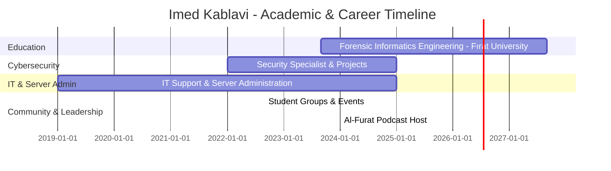

# 💫 About Me
- 🎓 Second-year **Forensic Informatics Engineering** student at Fırat University  
- 🔐 Cybersecurity specialist with **3+ years** of experience  
- 🖥️ IT support & server administration with **6+ years** of background  
- 🌐 Skilled in **server management, moderation, and IT projects**  
- 🛡️ Focus on **cybercrimes, digital forensics, and security awareness**  
- 📚 Leader of multiple **student groups and communities** in Turkey  
- 🎤 Organizer of **lectures, podcasts, and technical events** for students  
- 🌱 Passionate about learning **AI, cybersecurity, and software development**  

---

## 🌐 Socials
 
 
 
  

---

## 💻 Tech Stack

## 🏆 GitHub Trophies

### ✍️ Random Dev Quote

---

## 📅 Timeline: Education & Experience

  ## 💰 You can help me by Donating
   

  
